_原文: <https://ncona.com/2020/06/create-diagrams-with-code-using-graphviz/>_

程序员都喜欢操纵文本, 即使是为了生成一个流程图, 操纵文本也比拿鼠标拖拖拽拽的灵活
快速. 有什么办法能让你使用自己喜欢的编辑器来生成各种图形呢. 我用过的有两个工具:
plantUML 和 graphviz.

这篇文章介绍一下 graphviz.

# 安装

- 如果在 Mac 上, 可以运行 `brew install graphviz` 安装
- Linux 可以使用 apt: `sudo apt install graphviz`
- 其他平台可参见官方文档: <https://www.graphviz.org/>

安装之后便可以使用 `dot` 命令从代码生成图形图片: `dot -Tpng input.gv -o
output.png`.

上面这条命令从 `input.gv` 生成 `output.png` 图片. graphviz 代码文件一般用 `.gv`
后缀. `-Tpng` 指示 `dot` 生成 png 格式图片.

# 可选: SublimeText 配置

如果你使用 SublimeText, 可以新增一套 build 系统. 这样一来便可以直接在
SublimeText 中, 通过快捷键直接生成并预览图片了:

1. 新建一个文件, 内容如下:

    ```js
    {
        "shell_cmd": "dot -Tpng $file -o $file_base_name.png && subl $file_base_name.png",
        "file_regex": ".gv$",
    }
    ```

2. 保存为 SublimeText 用户包里的 `graphviz.sublime-build` 即可

# 基本用法

一个简单的图形定义如下:

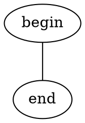


如果需要带箭头, 得使用 `digraph`

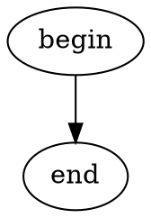


箭头可以是单向, 也可以是双向的:

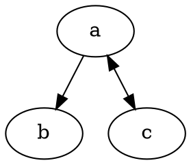


# 形状 (Shape)

不喜欢椭圆, 可以换其他的:

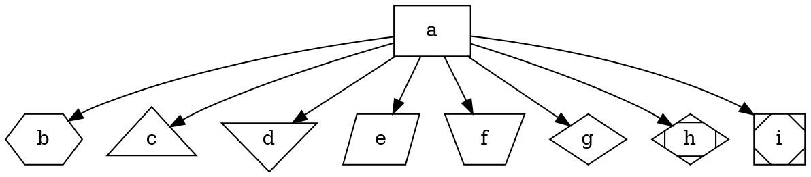


也可以给节点添加颜色和样式:

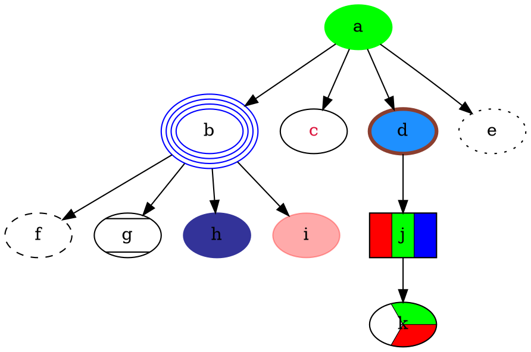


# 箭头 (Arrow)

可以修改箭头的头部和尾部:

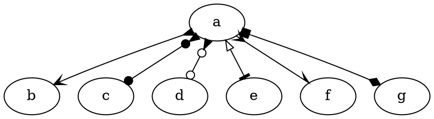


以及给箭头线添加样式:

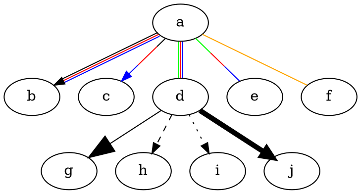


注意上面的代码中, 指定了多个颜色则会生成多条线. 如果想只为一条线指定多个颜色, 则
必须为其中至少一个颜色指定权重比, 如第四行的:

```dot
a -> e [dir=none,color="green:red;.3:blue"]
```

# 标签 (Label)

可以为节点添加标签:

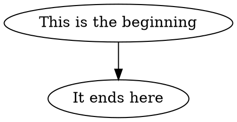


也可以为顶点添加标签:

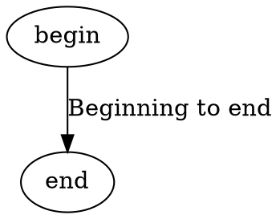


可以为标签添加样式:

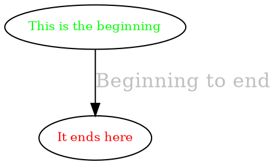


# 集群 (Cluster)

集群也叫子图. 子图的名称必须以 `_cluster` 开头, 否则它们不会被框住:

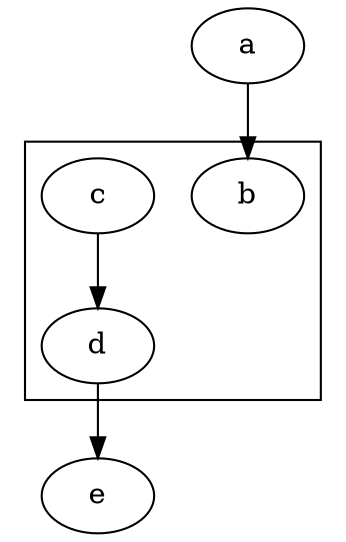


子图也可以嵌套:

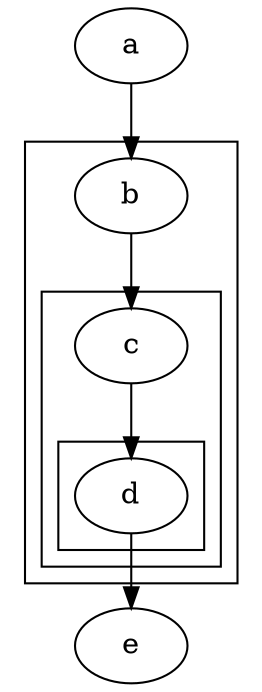


# HTML

使用 HTML 可以创建更复杂的节点, 并且可以拆分每个节点成多个部分, 每个部分都能独立
的在图形中被引用:

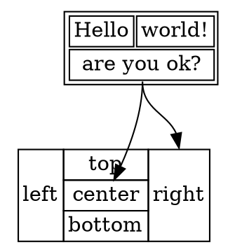


注意:
- 只有一部分 HTML 可以用来创建节点
- 必须指定 `shape=plaintext` 才能被正确渲染.
- 指定的 `port` 属性, 可以让我们后续使用 `a:a1` 引用特定某个单元格

可以为 HTML 节点添加样式:

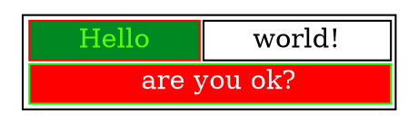


# 图片 (Image)

有时我们希望让某个节点显示为某个图标, 可以使用 `image` 属性指定:

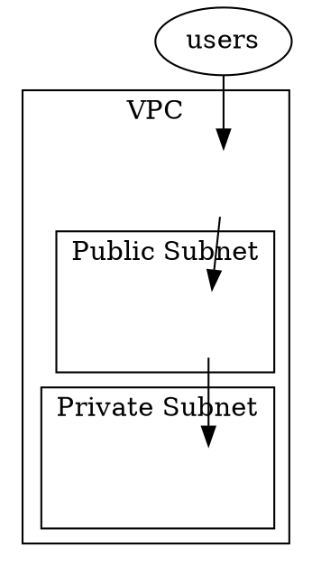


# 等级 (Rank)

Rank 会改变渲染引擎的工作方式.

一般来说, 图形都是从上到下渲染:

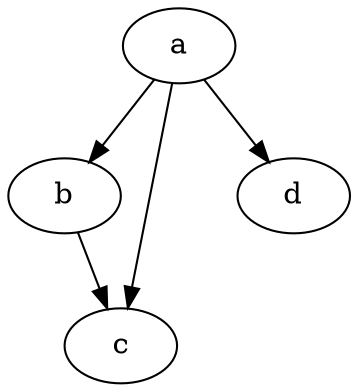


使用 `rankdir` 属性, 可以改成从左到右渲染:

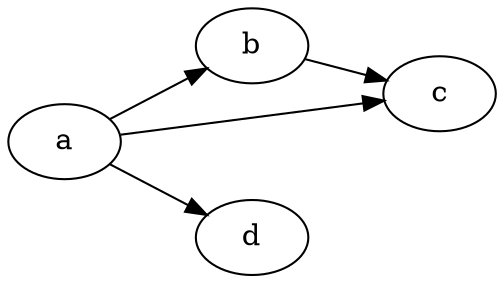


Rank 还可以用来强制一个节点跟另一个节点在同一层:

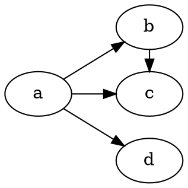


上例中, 使用了 `rank=same` 让 c 和 b 对齐

`rankdir` 属性是全局的, 所以不能在子图中改变它. 但是使用 `rank` 属性, 可以模拟一
个从左到右渲染的子图:

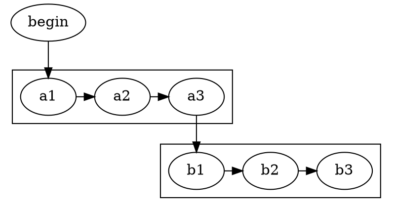


使用 `rank` 和 `constraint=false`, 可以创建更紧凑的图形:

```dot
digraph MyGraph {
  subgraph cluster_A {
    a1
    a2
    a3
    {rank=same;a1;a2;a3}
  }

  subgraph cluster_B {
    b1
    b2
    b3

    {rank=same;b1;b2;b3}
  }

  begin -> a1
  a1 -> a2 [constraint=false]
  a2 -> a3 [constraint=false]
  a3 -> b1
  b1 -> b2
  b2 -> b3
}
```


Rank 也可以用来指定每个节点之间的距离:

```dot
digraph MyGraph {
  rankdir=LR
  ranksep=1
  a -> b
  b -> c
  c -> d
}
```


默认的 `ranksep` 是 `.5`

# 结语

这篇文章只是简单介绍一下 graphviz 的我最常使用的用法和功能. 有关更多的诸如形状,
箭头语法, 可使用的颜色名, HTML 子集等, 可参见官方文档.

一些相关的工具:

- 在线可视化 graphviz 编辑器: <http://magjac.com/graphviz-visual-editor/>
- 另一个在线工具: <http://www.webgraphviz.com>
- 提供 graphviz 实时预览, 语法检测 SublimeText 包:
  <https://packagecontrol.io/packages/Graphvizer>
